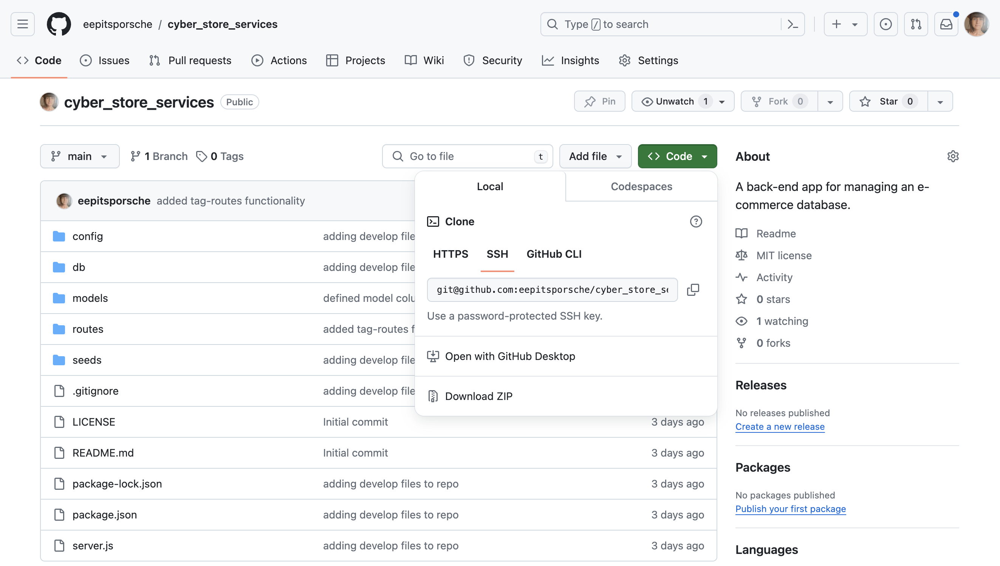
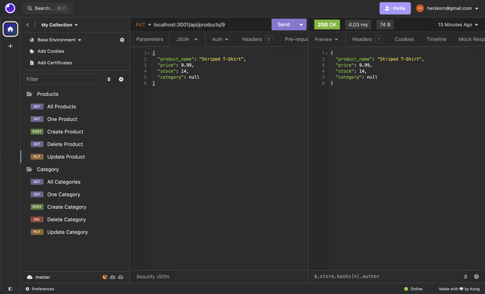

# Cyber Store Services

## Table of Contents

* [Description](#description)
* [Installation](#installation)
* [Usage](#usage)
* [Credits](#credits)
* [Technologies Used](#technologies-used)
* [License](#license)

## Description
The Cyber Store Services app is an e-commerce back-end database management system which provides users with a program to create and maintain a database of e-commerce inventory. The program utilizes the Express.js API to use Sequelize and interact with a MySQL database. Request routes enable operations to create, read, update, and delete and are executed through use of Sequelize models.

Future development for this app would include functions to manage customer accounts and orders.

## Installation
* [Inquirer v8.2.4](https://www.npmjs.com/package/inquirer/v/8.2.4) must be installed to operate this app.
* [MySQL2](https://www.npmjs.com/package/mysql2) must be installed to operate this app.
* [Sequelize](https://www.npmjs.com/package/sequelize) must be installed to operate this app.
* [dotenv](https://www.npmjs.com/package/dotenv) must be installed to operate this app.
* [Insomnia](https://docs.insomnia.rest/insomnia/install)  must be installed to operate this app.

## Usage
[Clone the repository](https://github.com/eepitsporsche/cyber_store_services) to your machine and open the application in VS Code.

* To initiate the Cyber Store Services, enter the <code>node server.js</code> command into the server.js terminal.

> [!IMPORTANT]
 Ensure you have installed all dependencies listed under [Installation](#installation) before initiating the program.

* WIthin the .env file, enter the MySQL authentication information in the <code>DB_USER</code> and <code>DB_PASSWORD</code> fields.

* Initiate the MySQL shell using the <code>mysql -u root -p</code> command and enter your MySQL password when prompted.

* Source your database file using the command <code>source db/schema.sql;</code> and exit MySQL with the command <code>exit</code>.

* Apply seed data to the database using the command <code>npm run seed</code>.

* Start the program using the command <code>npm start</code>.

* Use the Insomnia app to test route functionality.

> [Click here](https://drive.google.com/file/d/1Jo0VVDqvNHyYENRCp3UnqxA6Jxab0Qj6/view?usp=sharing) to view the video walk-through.

## Credits
* [mdn web docs_](https://developer.mozilla.org/en-US/docs/Web/HTTP/Status) was used for status code information.
* [Sequalize Docs](https://sequelize.org/docs/v6/core-concepts/model-querying-basics/) was used for information on model querying.
* [unblockMe YouTube Channel](https://www.youtube.com/watch?v=9IH-WFmk-9k)
* UCB Bootcamp Instructor: [Robbert Wijtman](https://github.com/Bucky24)
* UCB Bootcamp provided file structure and function framework for this project.

## Technologies Used
* VS Code
* JavaScript
* Node.js
* MySQL2
* Sequelize
* dotenv
* Insomnia

## License
<a href="https://opensource.org/licenses/MIT">MIT License</a>

Copyright© 2024 Porsche Herskorn

Permission is hereby granted, free of charge, to any person obtaining a copy of this software and associated documentation files (the "Software"), to deal in the Software without restriction, including without limitation the rights to use, copy, modify, merge, publish, distribute, sublicense, and/or sell copies of the Software, and to permit persons to whom the Software is furnished to do so, subject to the following conditions:

The above copyright notice and this permission notice shall be included in all copies or substantial portions of the Software.

THE SOFTWARE IS PROVIDED "AS IS", WITHOUT WARRANTY OF ANY KIND, EXPRESS OR IMPLIED, INCLUDING BUT NOT LIMITED TO THE WARRANTIES OF MERCHANTABILITY, FITNESS FOR A PARTICULAR PURPOSE AND NONINFRINGEMENT. IN NO EVENT SHALL THE AUTHORS OR COPYRIGHT HOLDERS BE LIABLE FOR ANY CLAIM, DAMAGES OR OTHER LIABILITY, WHETHER IN AN ACTION OF CONTRACT, TORT OR OTHERWISE, ARISING FROM, OUT OF OR IN CONNECTION WITH THE SOFTWARE OR THE USE OR OTHER DEALINGS IN THE SOFTWARE.

### 
[Back to Top](#cyber-store-services)
